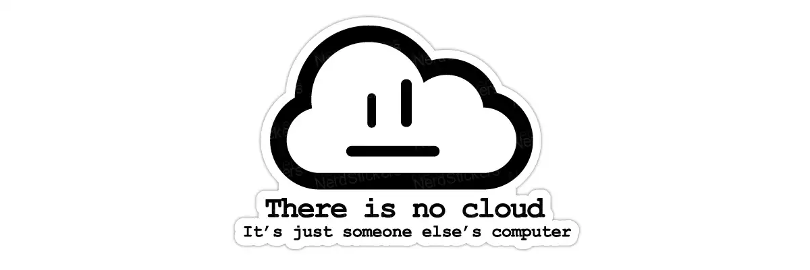
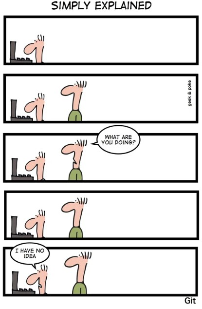

-->
📝 ***Feel free to contact me. I'll answer as soon as I can ...***  
 
  
  
  -->

<h1 align="center"></h1>
<h2 align='center'><samp>Hi there 👋, I am <strong>Raphael Baldini</strong></samp></h2>

DevOps Expert | Technical Manager | AWS Expert 

 📫 As someone who is always passionate for learning more about life. I like to develop scripts to make the things easier. I have evolved into a Infrastructure career path, starting as DBA and moving foward to DevOps area.

<h3 align="left">Languages and Tools:</h3>

 
  
   
   
   
   
   
   
  
    
   
  
   
   
   
   
  
   
   
   
  
  

<h3 align="left">**Interested:**</h3>

 
  
  
  

  
  
  

